# Индивидуальная работа по курсу "Frameworks for Web Application Development"

## Требования к индивидуальной работе

### Разработка серверной части приложения

#### Функциональные требования

1.  Разработайте backend приложения, который предоставляет серверную логику и взаимодействует с базой данных. Приложение должно включать минимум три основных ресурса (например, "публикации", "категории" и "пользователи").
2.  Реализуйте систему аутентификации и авторизации пользователей.
3.  Обеспечьте возможность создания, чтения, обновления и удаления записей (CRUD) для каждого из ресурсов.
4.  Обрабатывайте ошибки и исключения на сервере, предоставляя понятные сообщения об ошибках для клиентской части.
5.  Валидируйте входные данные для всех запросов к приложению. В случае нарушения валидации возвращайте соответствующие ошибки.
6.  Напишите тесты, проверяющие как минимум две функциональности.
7.  Добавьте дополнительные функции, которые, по вашему мнению, улучшат пользовательский опыт и функциональность приложения. Это могут быть такие функции, как поиск и фильтрация записей, загрузка файлов и т. д.

#### Нефункциональные требования

1.  Backend должен быть разработан с использованием современного веб-фреймворка по вашему выбору.
2.  Обеспечьте безопасность вашего приложения, включая защиту от атак, таких как SQL-инъекции, CSRF и XSS.
3.  Задокументируйте структуру веб-приложения, включая маршруты, контроллеры и модели, чтобы облегчить понимание и работу с проектом.

### Разработка клиентской части приложения

#### Функциональные требования

1.  Разработайте пользовательский интерфейс для взаимодействия с API серверной части. Интерфейс должен быть интуитивно понятным и удобным для пользователей.
2.  Реализуйте функции для отображения, создания, обновления и удаления данных, соответствующих ресурсам backend.
3.  Внедрите валидацию входных данных и отображение понятных сообщений об ошибках в случае ввода некорректной информации.
4.  Добавьте возможность сортировки, поиска по ключевым словам и фильтрации данных по категориям.
5.  Реализуйте валидацию входных данных для всех запросов к приложению.
6.  Включите дополнительные функции, которые улучшат пользовательский опыт и расширят функциональность вашего приложения. Это могут быть интерактивные элементы, адаптивный дизайн, оптимизация и другие особенности, делающие приложение более удобным и привлекательным.

#### Нефункциональные требования

1.  Используйте современные фреймворки или библиотеки для разработки клиентской части приложения, такие как React, Angular, Vue.js или любые другие, которые вы считаете подходящими.
2.  Оптимизируйте производительность клиентской части приложения, уделяя внимание скорости загрузки и отзывчивости интерфейса.
3.  Задокументируйте структуру клиентской части приложения.

## Инструкция по запуску проекта


1. Установите `XAMPP Control Panel`

2. Запустите `XAMPP Control Panel`

3. Склонируйте проект с `Git`

```git clone https://github.com/yusyumbeli03/Frameworks_LI```

4. Перейдите в репозиторий проекта

``` cd hotel_project```

5. Установите зависимости

```composer install```

6. Настройте файл `.env` 

```
DB_CONNECTION=mysql
DB_HOST=127.0.0.1
DB_PORT=3306
DB_DATABASE=db_name
DB_USERNAME=user_name
DB_PASSWORD=password
```
7. Сгенерируйте ключ приложения

```php artisan key:generate```

8. Настройте Базу Данных
- Убедитесь, что сервер базы данных работает (например, MySQL).
- Создайте базу данных с именем, указанным в `.env`.

9. Запустите миграции.

 ```php artisan migrate```

10. Запустите локальный сервер

```php artisan serve```

11. Перейдите по ссылке

  INFO  Server running on [http://127.0.0.1:8000].  

## Автор проекта 

 __Юсюмбели Алёна__ - студентка 3-го курса группы IA2202

 ## Цель проекта

 Разработать веб-приложение для управления отельной системой. 

## Описание индивидуальной работы

В данной индивидуальной работе было разработано веб приложение с использованием `Laravel` фреймворка, темой которой является онлайн система бронивания номера в отеле. Имеются определённые возможности доступные обычному пользователю, а также администратору системы.

## Представление проекта

1. Страница для регистрации

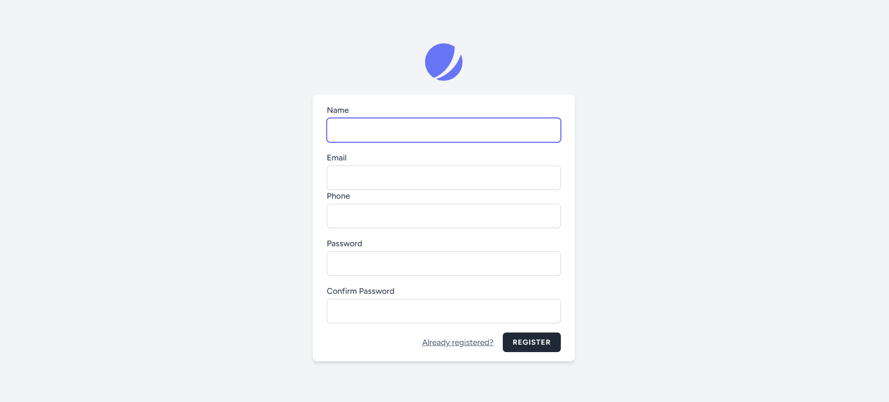

2. Страница для аутентификации

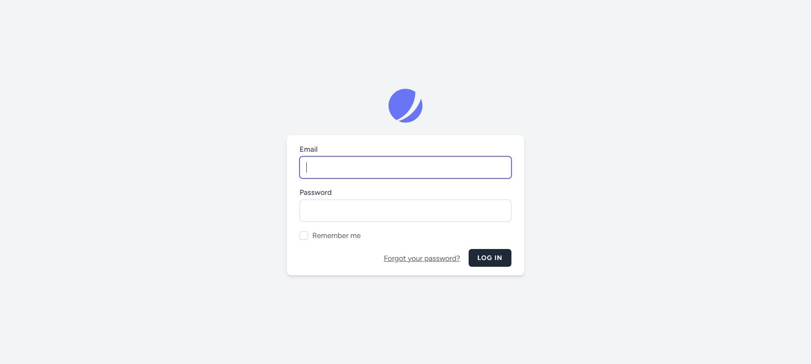

> Для реализации страниц регистрации и аутентификации был использован `Jetstream` .

3. Главная страница  

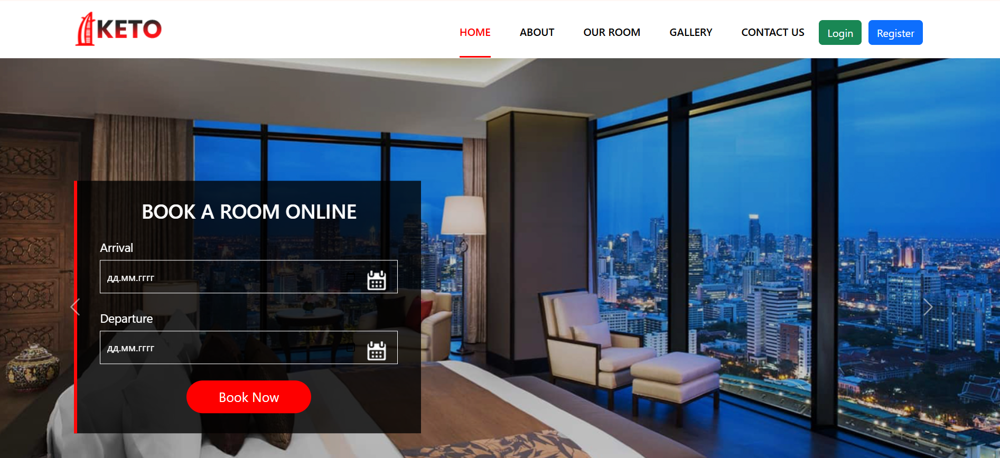

4. Страница `About`

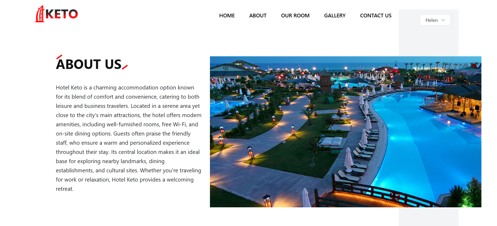

5. Страница всех номеров отеля, которые можно забронировать

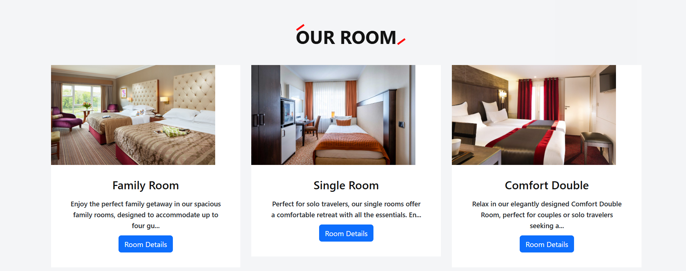

6. Если нажать кнопку `Room Details` , то будет предоставлена более подробная информация о комнате и можно будет забронировать номер.

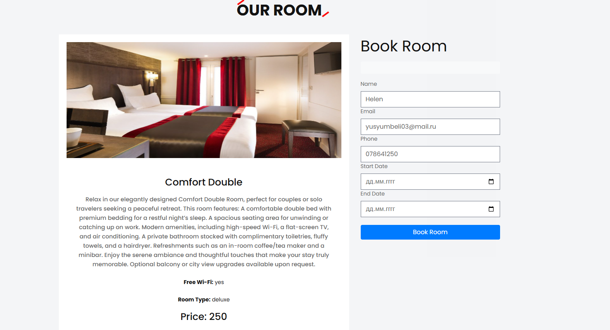

> Имя, почта и номер автоматически вставляются в поля , если пользователь уже аутентифициировался.
>
> Если номер уже забронирован, то выводится соответствующее сообщение.
>
>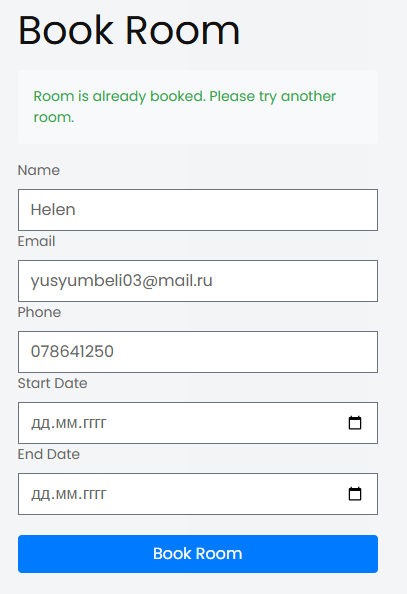
>
> Так же есть валидация на данные поля
> 
>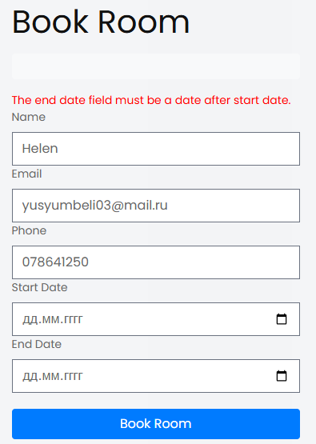 

7. Страница `Gallery`

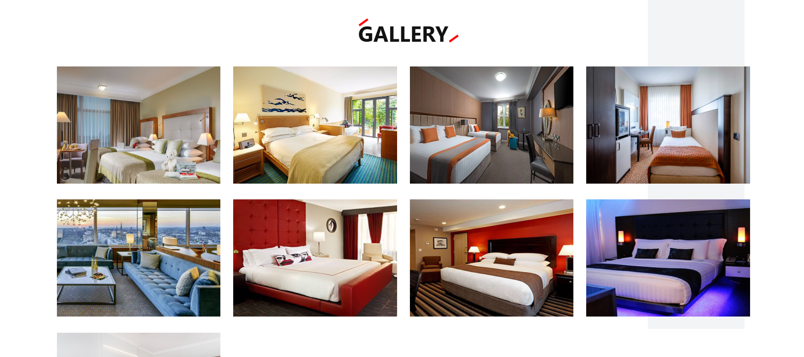 

8. Страница `Contact Us`

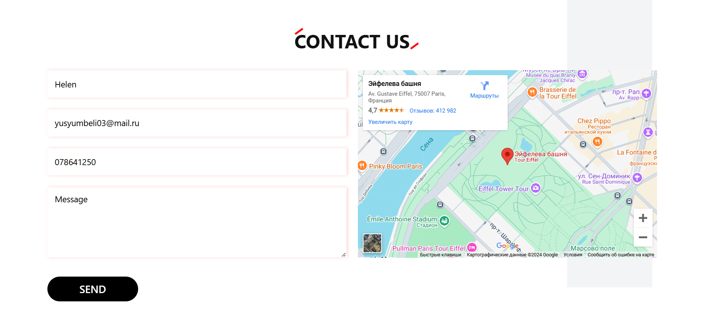 

## Админская панель

1. `Dashboard`

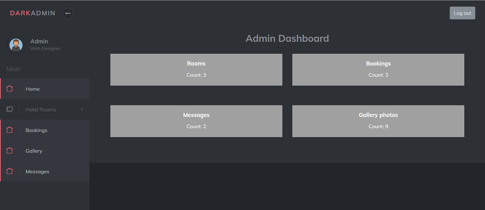 

2. Страница добавления нового номера

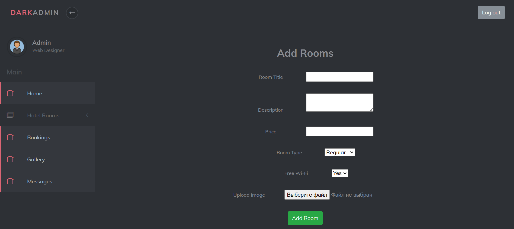

> Так же есть валидация для этой формы
>
>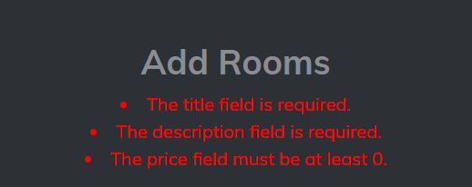

3. Просмотр всех номеров

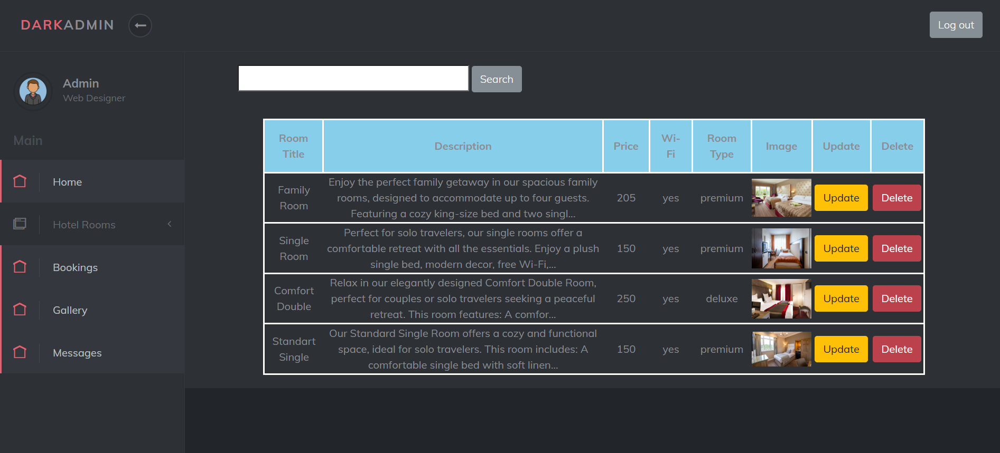

> На странице есть возможность поиска!
> 
>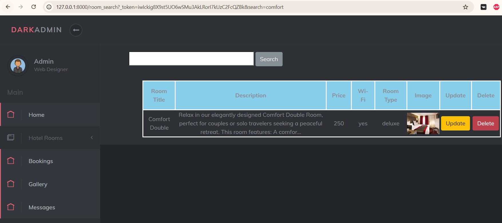

4. Редактирование информации о номере

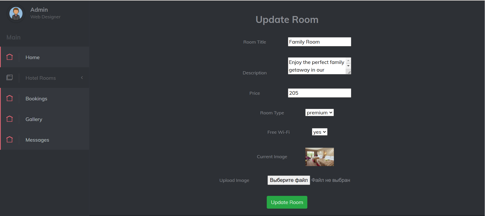

5. Бронирования номеров

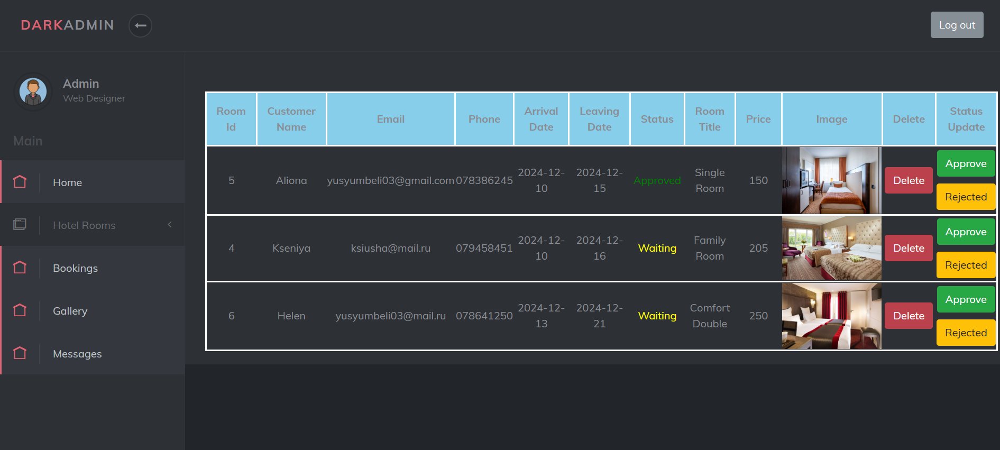

> Админ может просматривать информацию , менять статус брони, удалить бронь . 
>
> Инфомация берётся из двух таблиц (данные заказчика и данные номера)

6. Добавление фотографий в галерею

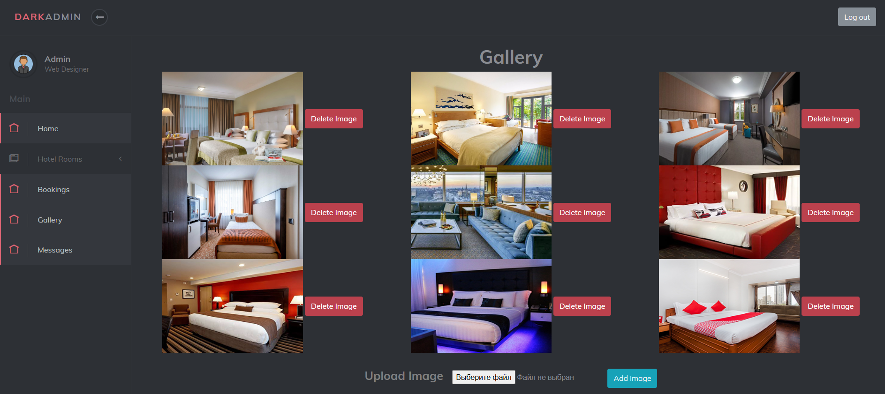

> Можно добавлять фото и удалять сохранённые

7. Информация из страницы `Contact Us`

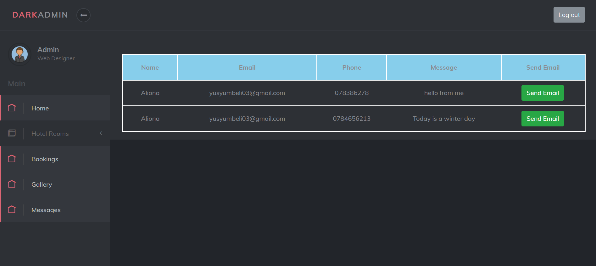

8. Можно отправлять смс по почте)

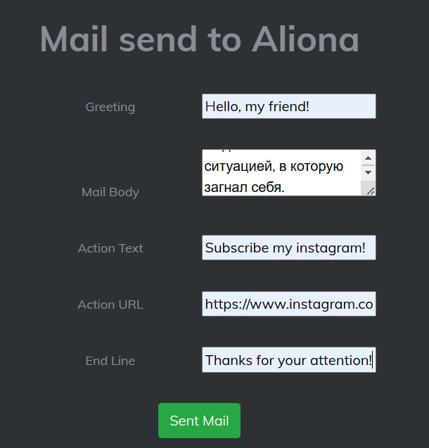

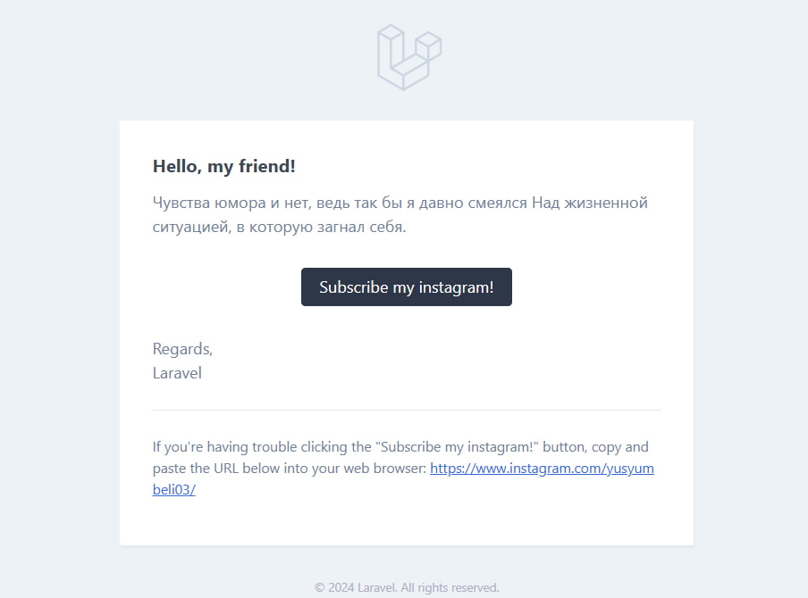

## Выводы

В ходе выполнения данной работы была разработана веб-система для управления отельной системой с использованием фреймворка `Laravel`. Разработка включала реализацию клиентской и административной частей, что позволило создать функциональный и удобный инструмент для пользователей и администраторов.

Ключевые результаты:

1.  **Функциональность для пользователей**:

    -   Реализованы страницы для регистрации и аутентификации, обеспечивающие безопасный доступ к системе.
    -   Предоставлены возможности просмотра номеров, подробной информации о них, а также бронирования с учётом проверки доступности номера и валидации данных.
2.  **Административная панель**:

    -   Включены функции управления номерами (добавление, редактирование, просмотр) и бронированиями.
    -   Реализована возможность загрузки фотографий в галерею и управления ими.
    -   Предусмотрен просмотр обратной связи с пользователей через форму `Contact Us` с возможностью отправки ответов на email.
3.  **Технические аспекты**:

    -   Использован `Jetstream` для реализации аутентификации и базовой структуры проекта.
    -   Обеспечена валидация данных в формах для предотвращения ошибок ввода.
    -   Реализована интеграция нескольких таблиц базы данных для обработки бронирований.

Данная работа продемонстрировала практическое применение технологий веб-разработки для создания системы управления бронированием номеров, позволив:

-   Научиться проектировать и реализовывать многофункциональные веб-приложения.
-   Улучшить навыки работы с базами данных, валидацией и пользовательскими интерфейсами.
-   Организовать взаимодействие между клиентской и серверной частями приложения.

Разработанная система может быть расширена и интегрирована с дополнительными сервисами (например, платёжные системы), что делает её гибкой для дальнейшего использования в реальных условиях.

## Список использованных источников

1. https://jetstream.laravel.com/introduction.html
2. https://getbootstrap.com/
3. https://github.com/yaminshakil/Hotel-Template
4. https://github.com/yaminshakil/Admin_Template
5. https://getbootstrap.com/